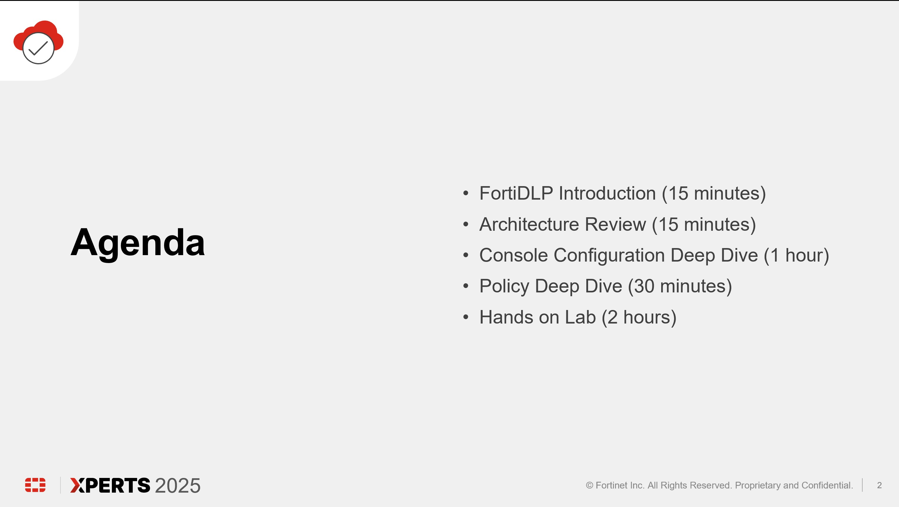

### ***FortiDLP Introduction***

FortiDLP is a next-generation endpoint DLP and insider risk management solution that helps companies anticipate and prevent data theft. It is a cloud native, SaaS hosted solution that solves the following use cases in a single platform: 

  - Data Loss Prevention
  - Insider Risk Management
  - SaaS Data Security

At the end of this session, attendees should have a solid understanding of the following FortiDLP concepts:
  - Product Architecture
  - Management Console Configuration
  - Policy Creation

* 
