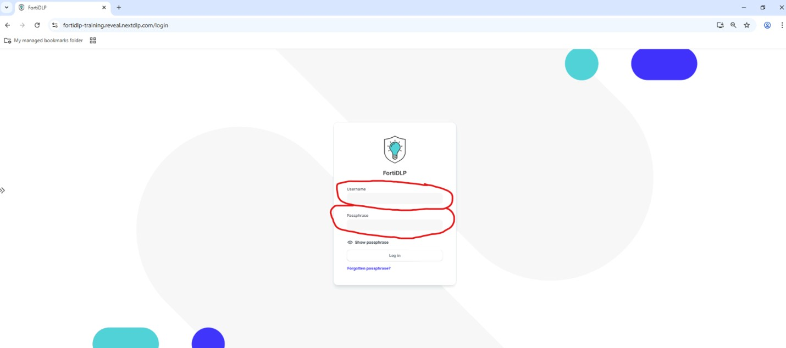
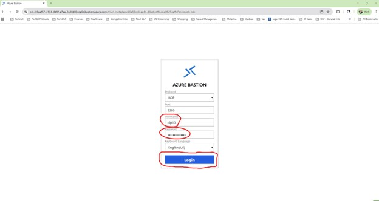
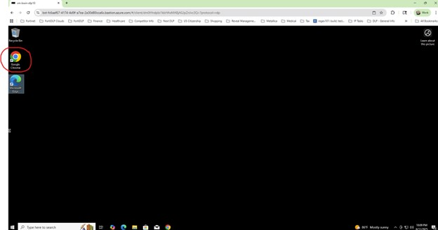
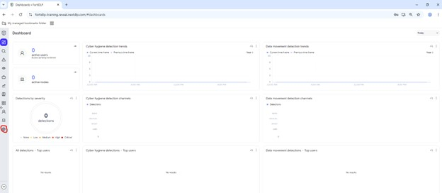
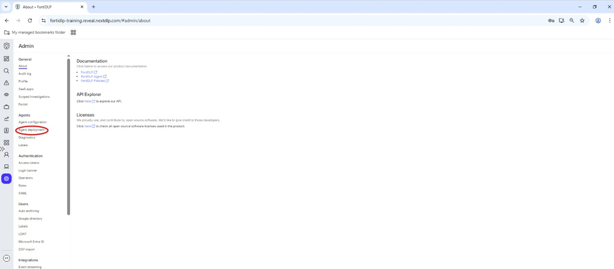
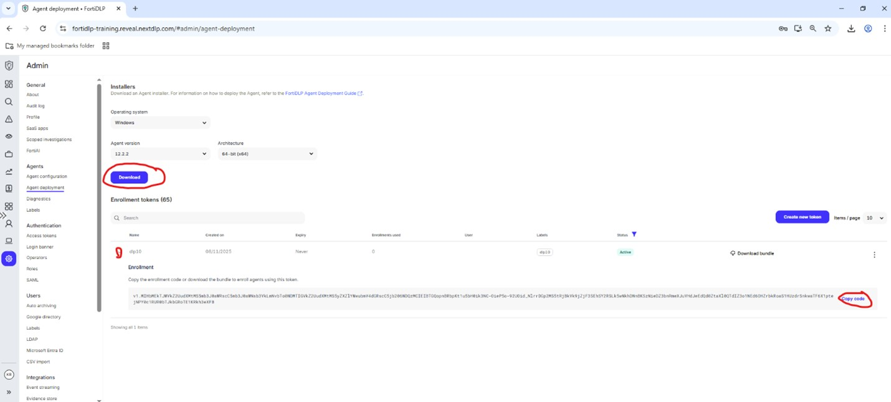
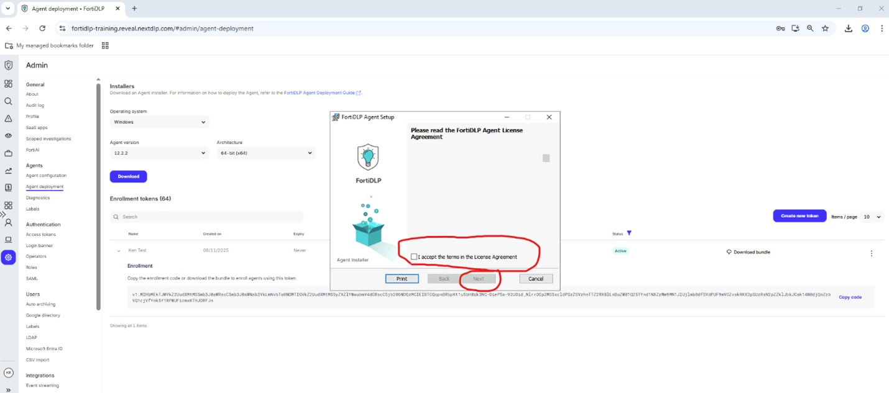
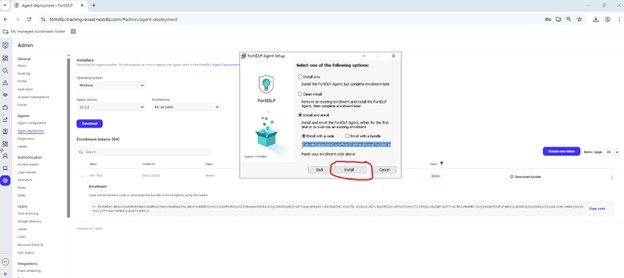
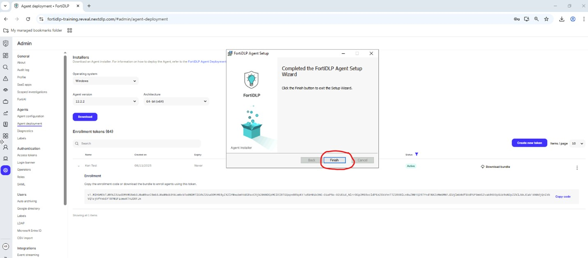
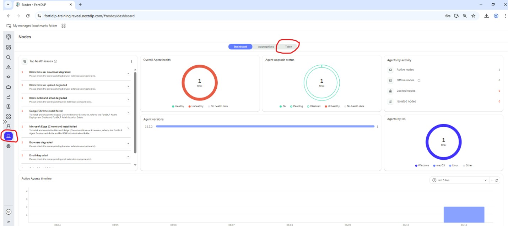

### Management Console Access Instructions

{} Please note that the FortiDLP management console is a shared environment. Any changes made can impact other users if not properly scoped via labels. Please see the "Lab Rules of Engagement" page before making any changes.{}

1)  Open your preferred browser (Chrome, Edge, or Firefox) and navigate to:

https://fortidlp-training.reveal.nextdlp.com/

2)  Login to FortiDLP with the course credentials you received via the email address you used to register for the course.

    

{} If you did not receive or cannot find the email with your login credentials, notify a course instructor who will initiate a "re-send" of the credentials. {}

{} Your user name is your first initial followed by your last name... NOT your email address (ex. John Smith would be "jsmith") {}

### Virtual Endpoint Access and Configuration Instructions

1)	Enter the URL for your specific assigned VM device.

2)	Enter your assigned “username” and “password” in the appropriate fields and click "Login". The Username identifies your device:
  
    

3)	On the VM device open the Chrome Browser:

    

4)	Enter the FortiDLP Training Platform URL in to the Chrome browser:

https://fortidlp-training.reveal.nextdlp.com/

5)	Logon to FortiDLP with your assigned course credentials:

    

6)	Click the "Admin" icon:

    

7)	On Admin page click “Agent Deployment” in the left hand pane:

    

8)  Expand the "XPERTS2025" enrollment code and click "Copy code" then click "Download" to obtain the agent installer:

    

9)  Go to "Downloads" folder and double click the agent installer package downloaded in the previous step

10) Accept the terms in the license agreement and click "Next:"

    

11) Paste the enrollment code copied in step 8 into the text box under "Install with a code" and click "Install:"

    

12) When prompted, click "Finish" to complete the install:

    

{} When prompted, DO NOT reboot the machine at this point! {}

13) Click "Nodes" in the left pane of the management console and click "Table" to confirm that your agent is reporting in successfully:

    

14) Reboot your VM and log in again.

15) CONGRATULATIONS! You have successfully installed the FortiDLP agent on your lab virtual machine.