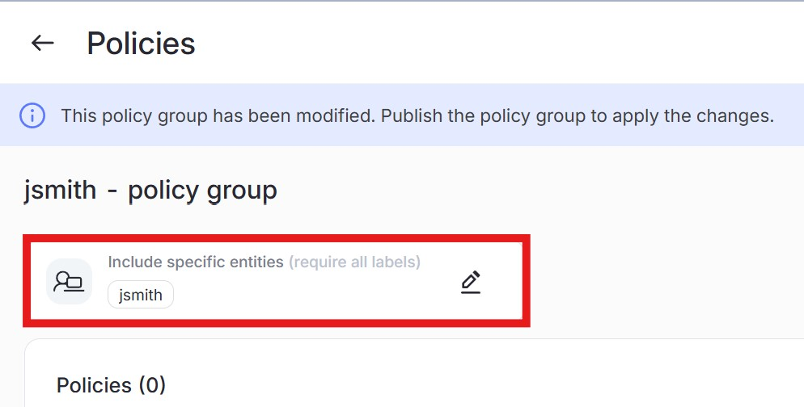

{} Please note that the FortiDLP management console is a shared environment. Any changes made can impact other users if not properly scoped via labels. Please see below before making any changes.{}

{}:bulb: If you did not receive or cannot find the email with your login credentials, notify a course instructor who will initiate a "re-send" of the credentials.{}

{}:bulb: When first created, all policy groups and configurations default to "All entities" in scope. Make sure to change the scope to your label ONLY! Failure to do so will impact other attendees' ability to test their configurations.   {}

{}:bulb: Use the following naming convention for all lab use cases and configurations:   
First initial followed by last name - use case number (ex. Josh Smith creating a policy for use case 3 would be "jsmith - Prevent upload of PII to website").{}

{}:bulb: All use case solutions are available in the "Lab Use Case Solutions" page accessible via the course registration page. Please only view them if you are uncertain how to solve a problem.{}