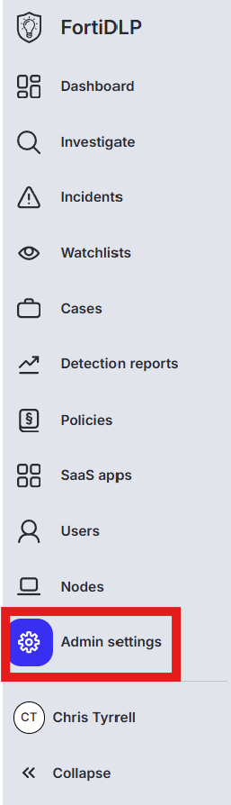
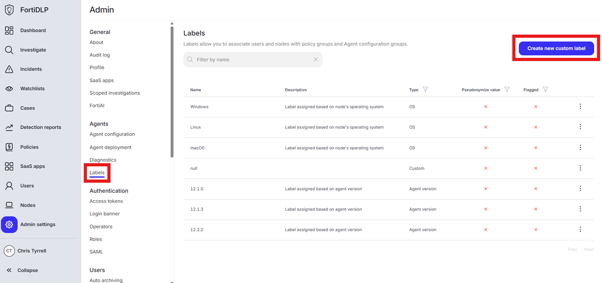
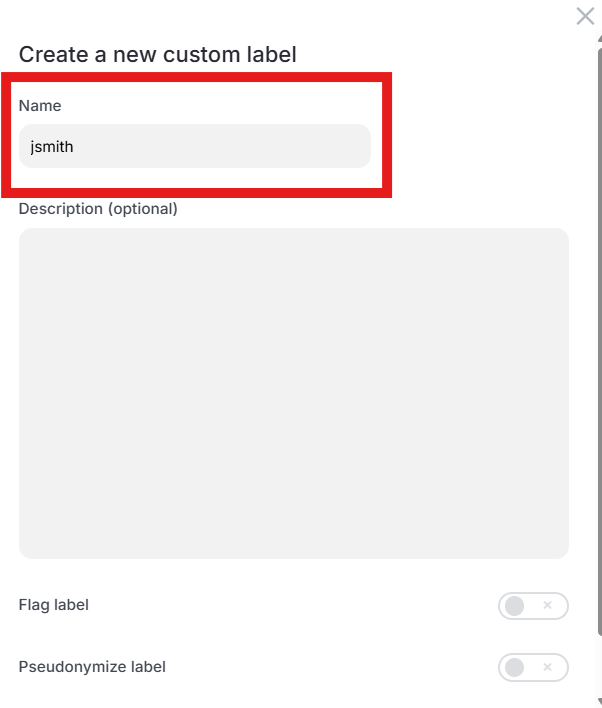

{} ### Create a custom label to use to apply a policy to your device only
{}

1. Click “Admin settings” in the left pane of the management console.

    

2. Click “Labels” and then “Create new custom label”
  
    

3. Enter your first initial last name in the “Name” text box (ex. John Smith will enter “jsmith”)

    