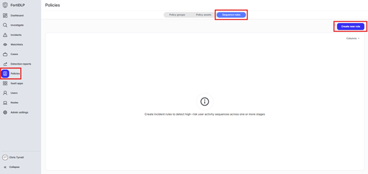
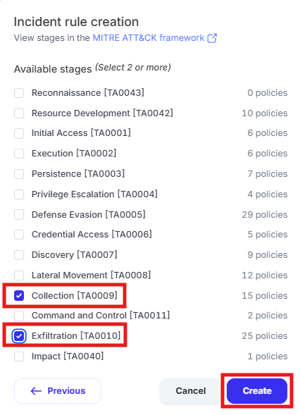
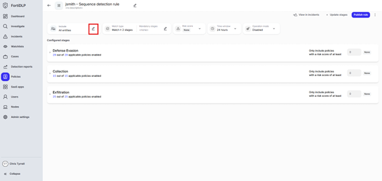
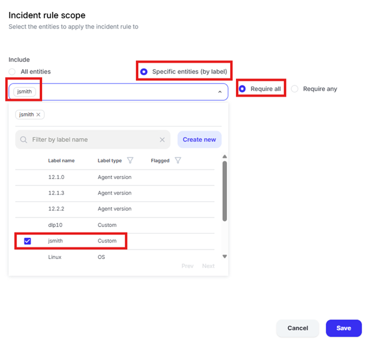
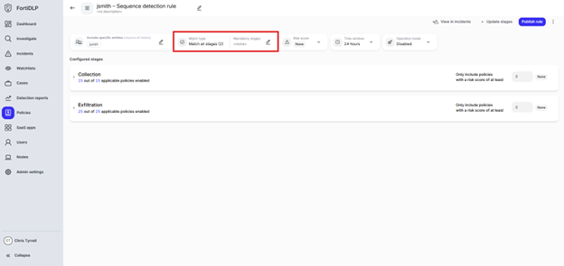
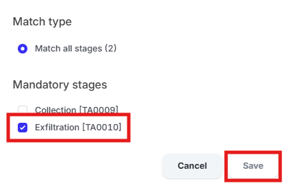
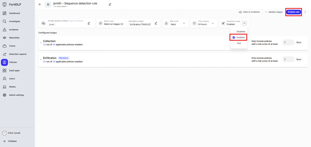

{} Create a "Sequenced Incident" for your device only

{}

1. Click “Policies” in the left pane of the management console and select “Sequence rules” in the top center of the screen. Click “Create new rule.”

    

2. Type “jsmith – Sequence detection rule” in the “Name” box and click “Next”

3. Select the following stages and click “Create” 
    a. Collection [TA0009] 
    b. Exfiltration [TA0010]

   

4. Click the edit pencil in the “Include” box

   

5. Select “Specific entities (by label)” and choose your label created in use case 1

   

6. Click the edit pencil in the “Mandatory stages” box

   

7. Select “Exfiltration [TA0010]” and click “Save”

   

8. Click “Operation mode” and click “Enabled” then click “Publish rule”

   