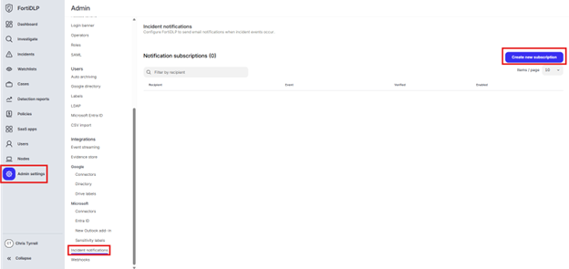
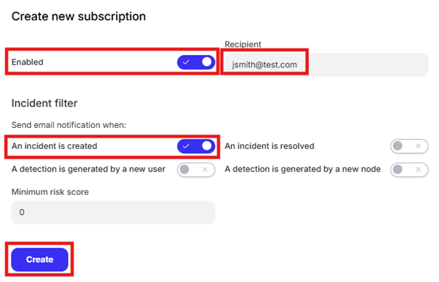

{} Create an "incident notification" to send an email alert for any incident created with severity over 90

{}

1. Click “Admin settings” in the left pane of the management console and click “Incident notifications.” Click “Create new subscription.”

    

2. Enter an email address in the “Recipient” text box. Enable the “An incident is created” button and click “Create.”

    