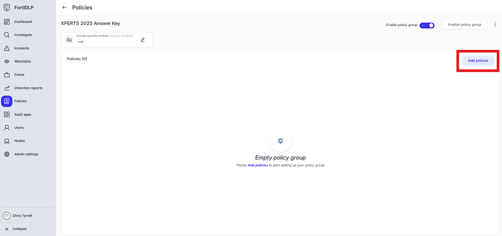
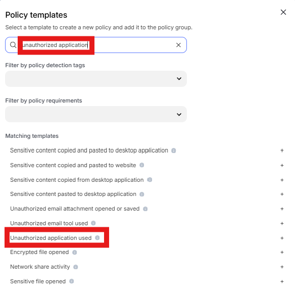
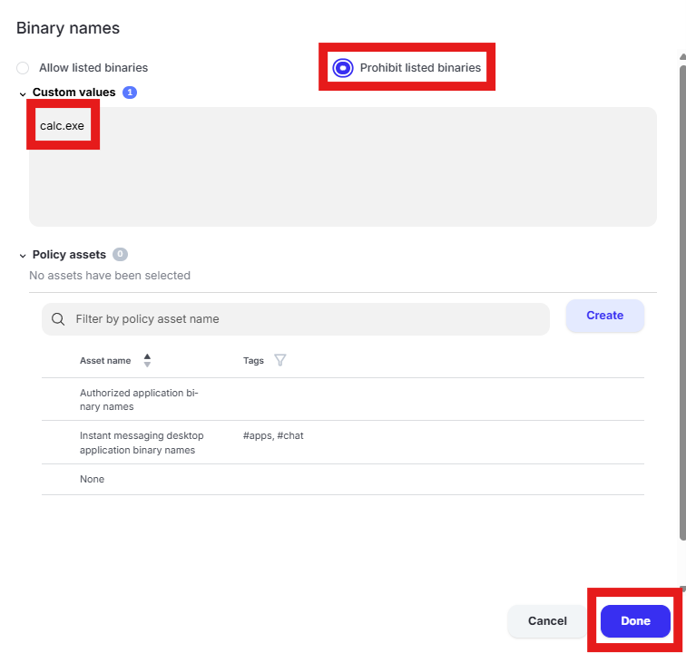
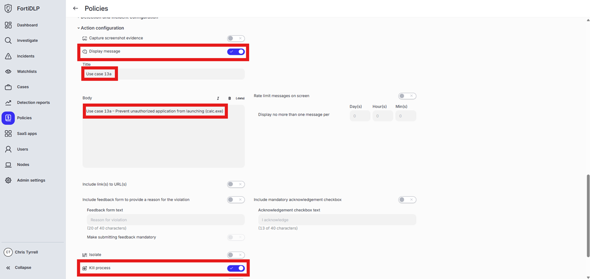

{} Prevent an unauthorized application from launching (calc.exe)

{}

1. Open the policy group created in use case 2 (if not already open)

2. Click “Add policies” 

    

3. Enter “unauthorized application” into the “Search” text box OR expand “External threat templates” and select “Unauthorized application used”

   

4. Change the policy name to “jsmith – Prevent unauthorized application from launching (calc.exe)” where “jsmith” is your first initial and last name.

5. Scroll to “Application parameters” and select “Process parameters.” Click the text box under “Binary names” 

6. Select “Prohibit listed binaries.” Remove the existing entries from “Custom values” and enter “calc.exe”. Click “Done”

   

7. Expand “Action configuration” and enable “Kill process” and “Display message.” Enter “Use case 13a” in the “Title” text box. Enter “Use case 13a – Prevent unauthorized application from launching (calc.exe)” in the “Body” text box. Optionally, enable the other options in the “Display message” area if desired.

   

8. Scroll down and click “Save and exit” in the lower right hand corner.