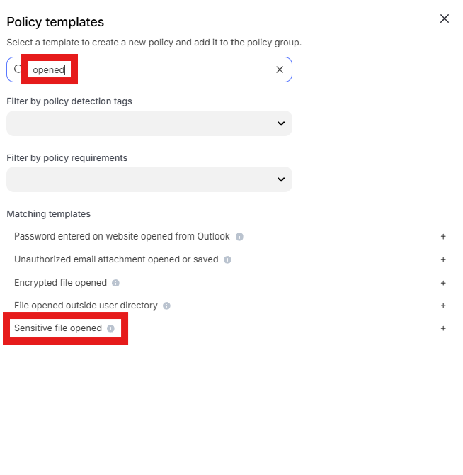
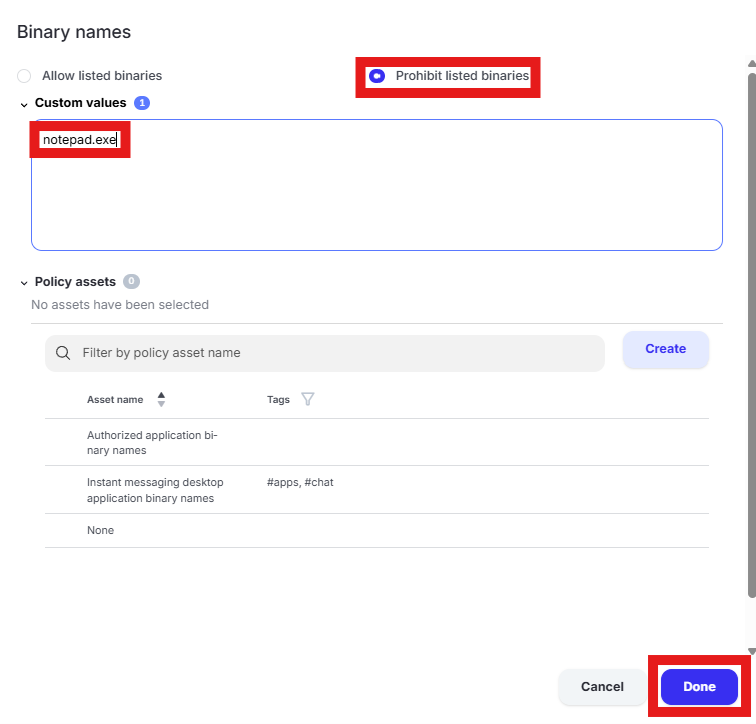
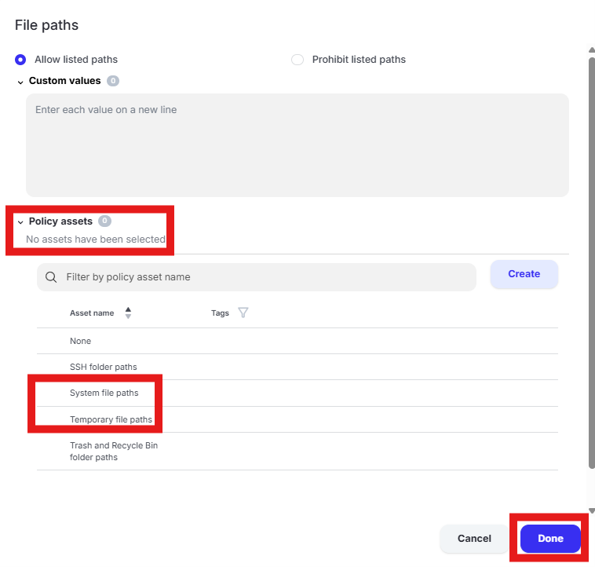
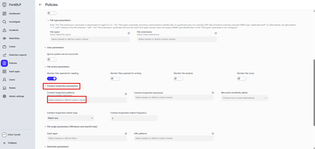
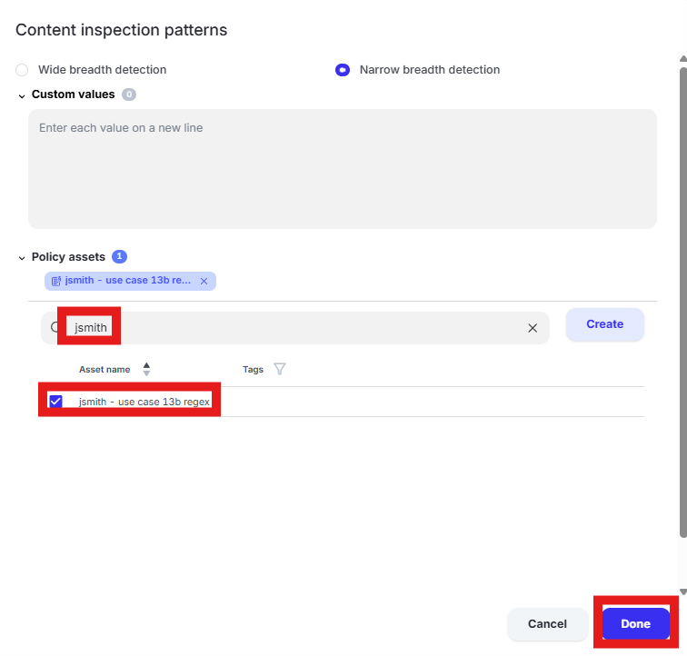
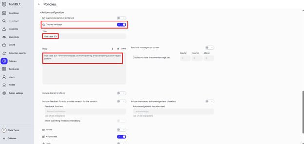

{} Prevent notepad.exe from opening a file containing custom regex pattern

{}

1. Open the policy group created in use case 2 (if not already open)

2. Click “Add policies” 

    

3. Enter “opened” into the “Search” text box OR expand “File templates” and select “Sensitive file opened”

   

4. Change the policy name to “Prevent notepad.exe from opening a file containing custom regex pattern” where “jsmith” is your first initial and last name.

5. Scroll to “Process parameters.” Click the text box under “Binary names”

6. Select “Prohibit listed binaries.” Remove the existing entries from “Custom values” and enter “notepad.exe”. Click “Done”

   

7. Scroll to “File parameters” and uncheck the selected “Policy assets” to clear them. Click “Done.” 

   

8. Scroll to “Content inspection parameters.” Click the text box under “Content inspection parameters.”

   

9. Enter “jsmith” into the “Filter by policy asset name” search box where “jsmith” is your first initial and last name. Select the custom regex pattern created in use case 13b. Click “Done.”

   

10. Expand “Action configuration” and enable “Kill process” and “Display message.” Enter “Use case 13c” in the “Title” text box. Enter “Use case 13c – Prevent notepad.exe from opening a file containing custom regex pattern” in the “Body” text box. Optionally, enable the other options in the “Display message” area if desired.

   

11. Scroll down and click “Save and exit” in the lower right hand corner.