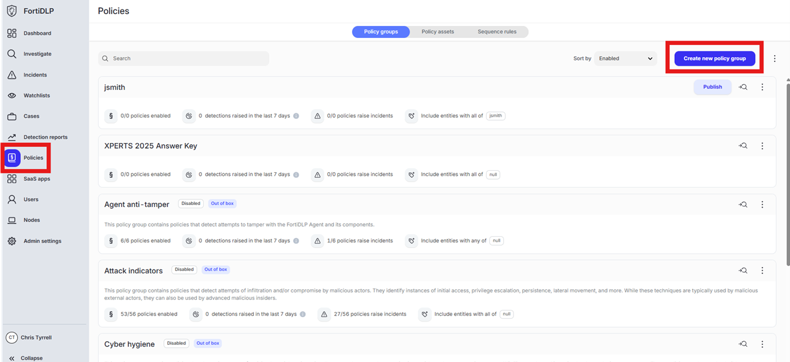
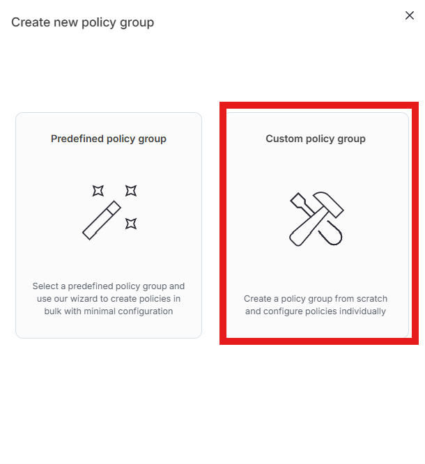
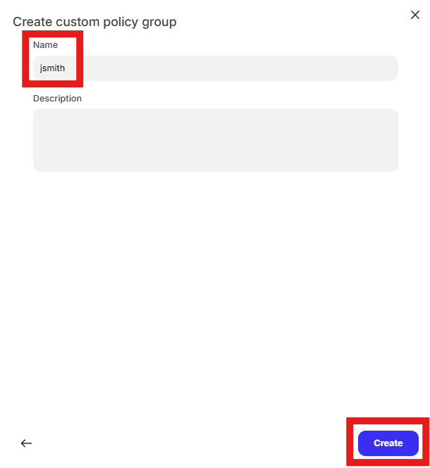
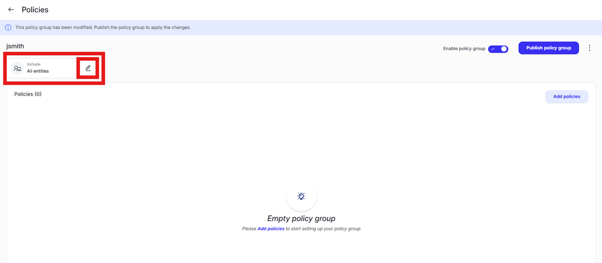
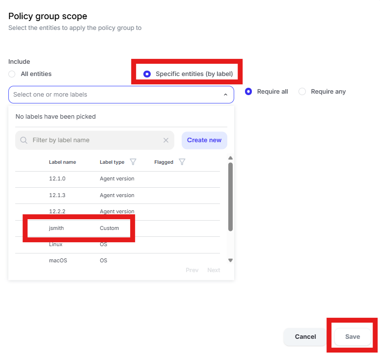

{} ### Create a new policy group and assign the label created in use case 1

{}

1. Click “Policies” in the left pane and click “Create new policy group”

    

2. Click “Custom policy group”
  
    

3. Enter first initial last name in the “Name” text box (ex. John Smith will enter “jsmith”) and click “Create”

    

4. Click the edit pencil in the “Include” box that currently shows “All entities”

    

5. Select the “Specific entities (by label) radio button and choose the label created in “Use case 1” and then click “Save”

    