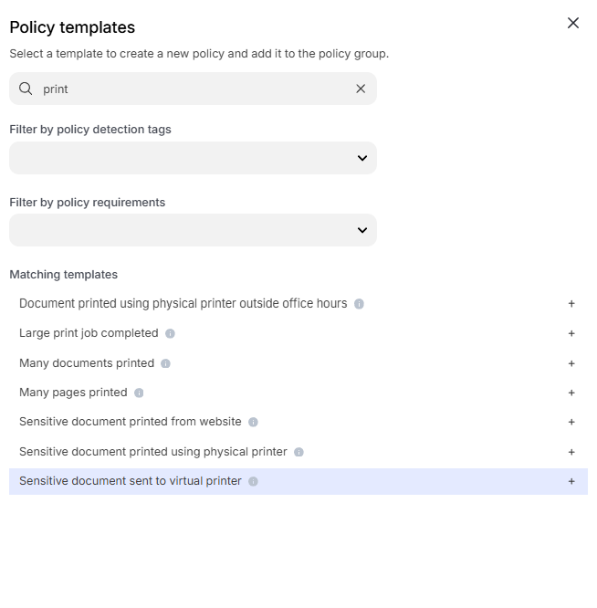
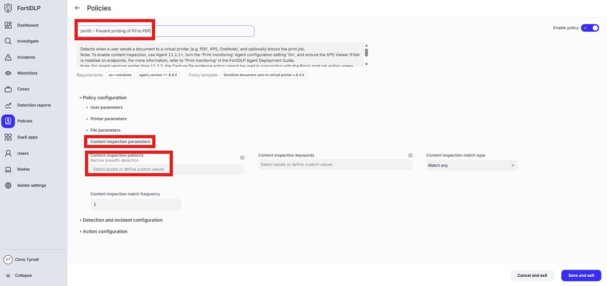
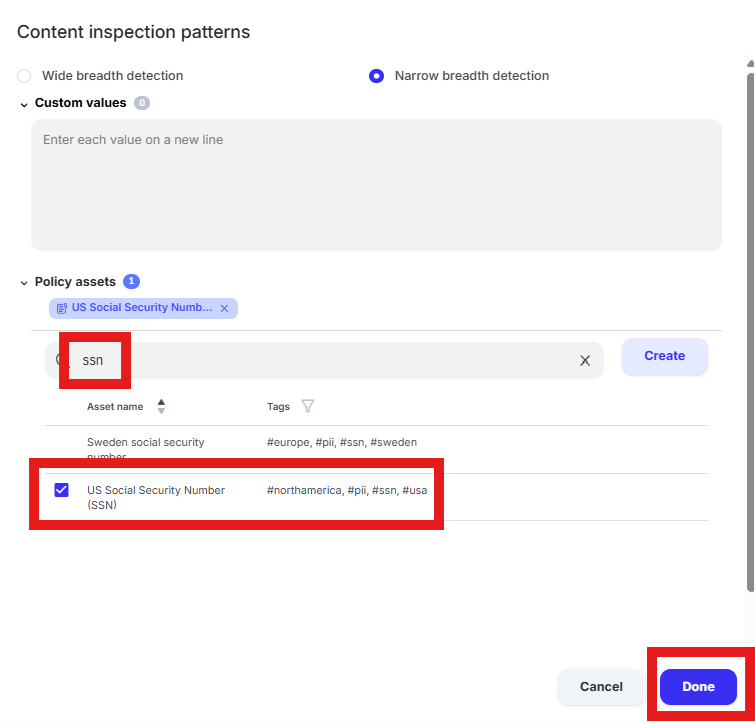
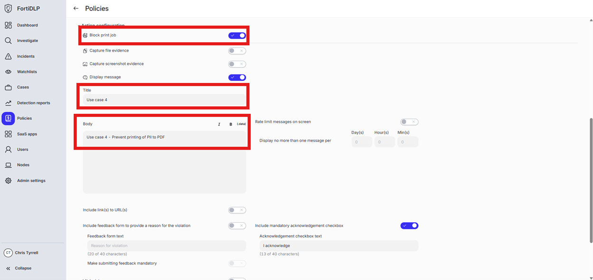

{} ### Prevent PII (US SSN) data from being printed to PDF

{}

1. Open the policy group created in use case 2 (if not already open)

2. Click “Add policies”

    

3. Enter “print” into the “Search” text box OR expand “Printing templates” and select “Sensitive document sent to virtual printer”

    

4. Change the policy name to “jsmith – Prevent printing of PII to PDF” where “jsmith” is your first initial and last name.

5. Scroll down to “Content inspection parameters” and click into “Select assets or define custom values”

    

6. Enter “ssn” in the “Filter by policy asset name” and select “US Social Security Number (SSN)” by placing a check in the box. Click “Done” to finalize selection of the pattern.

    

{} “Wide breadth detection” will match on the number only. “Narrow breadth detection” will match on the specified pattern in addition to a keyword as defined in the “Policy asset” being used. The test file downloaded from dlptest.ai will trigger the alert with either wide or narrow breadth selected.
{}

7. Expand “Action configuration” and enable “Block browser upload” and “Display message. Enter “Use case 4” in the “Title” text box. Enter “Use case 4 - Prevent printing of PII to PDF” in the “Body” text box. Optionally, enable the other options in the “Display message” area if desired.

   

8. Scroll down and click “Save and exit” in the lower right hand corner.

9. You should now see the newly created policy in the window
