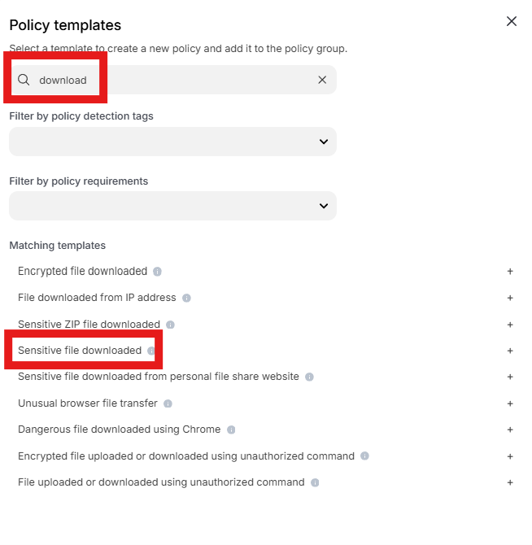
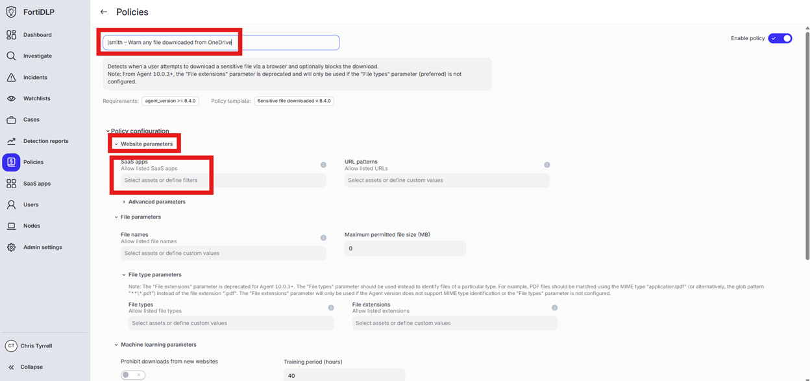
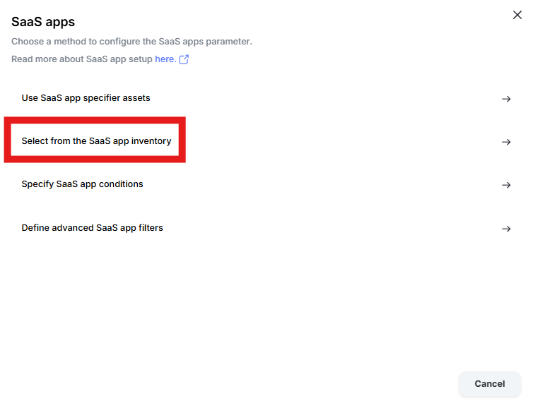
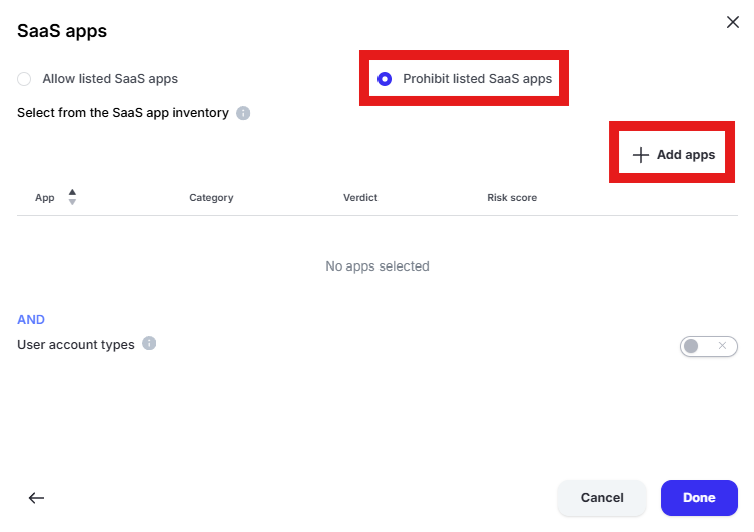
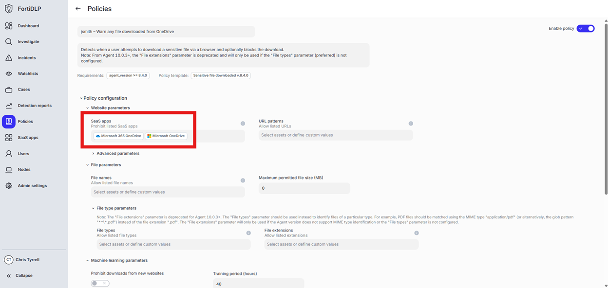
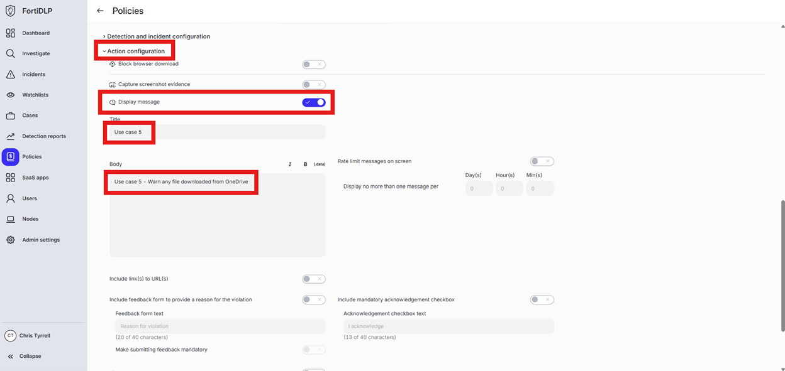

{} ### Generate a warning prompt for any file downloaded from OneDrive

{}

1. Open the policy group created in use case 2 (if not already open)

2. Click “Add policies”

    

3. Enter “download” into the “Search” text box OR expand “Browser templates” and select “Sensitive file downloaded”

    

4. Change the policy name to “jsmith – Warn any file downloaded from OneDrive” where “jsmith” is your first initial and last name.

5. Scroll down to “Website Parameters” and click into “Select assets or define filters” under “SaaS apps”

   

6. Click “Select from the SaaS app inventory”

   

7. Change the radio button to “Prohibit listed SaaS apps” and click “Add apps”

   

8. Enter “one” into the “Filter by SaaS app name” text box and select “Microsoft 365 OneDrive” and “Microsoft OneDrive” by placing checks in the box. Click “Add apps”

   

9. Click “Done” to add the apps to the policy

   

10. Expand “Action configuration” and enable “Display message. Enter “Use case 5” in the “Title” text box. Enter “Use case 5 – Warn any file downloaded from OneDrive” in the “Body” text box. Optionally, enable the other options in the “Display message” area if desired.

   

11. Scroll down and click “Save and exit” in the lower right hand corner.

12. You should now see the newly created policy in the window
