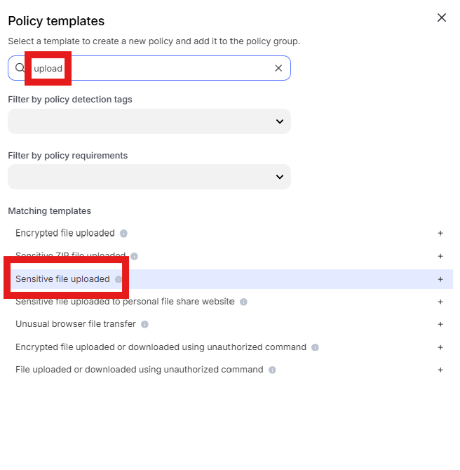
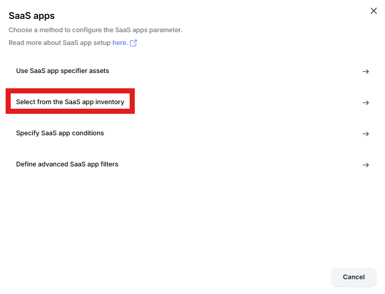
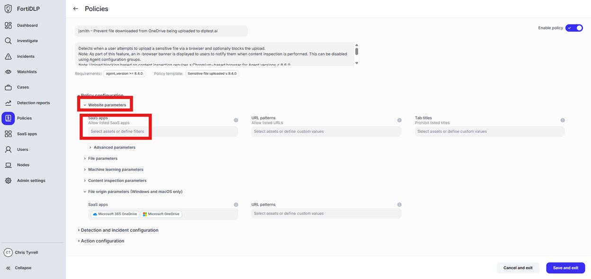
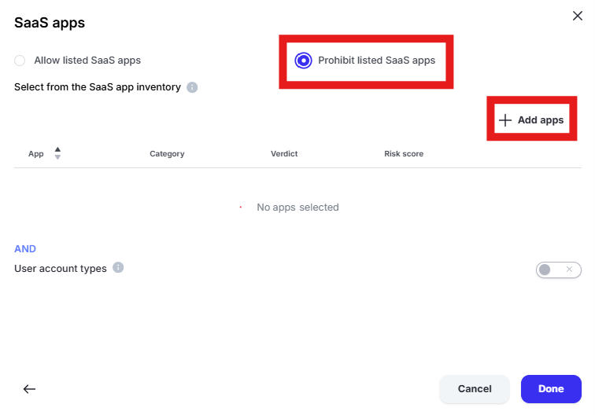
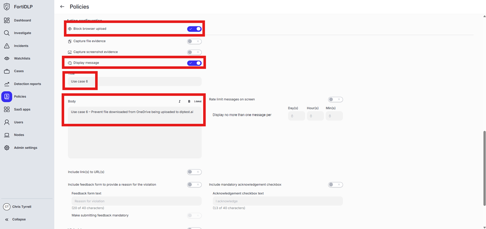

{} ### Prevent file downloaded from OneDrive being uploaded to dlptest.ai
{}

1. Open the policy group created in use case 2 (if not already open)

2. Click “Add policies”

    

3. Enter “Upload” into the “Search” text box OR expand “Browser Templates” and select “Sensitive file uploaded”

    

4. Change the policy name to “jsmith – Prevent file downloaded from OneDrive being uploaded to dlptest.ai” where “jsmith” is your first initial and last name.

5. Scroll down to “File origin parameters (Windows and macOS only)” and click into “Select assets or define filters”

    

6. Click “Select from the SaaS app inventory”

    

7. Click “Add Apps” in the upper right hand corner of the window

    

8. Enter “one” into the “Filter by SaaS app name” text box and select “Microsoft 365 OneDrive” and “Microsoft OneDrive” by placing checks in the box. Click “Add apps”

    

9. Click “Done” to add the apps to the policy

10. Scroll to “Website parameters” and click “Select assets or define filters” under “SaaS apps”

    

11. Change the radio button to “Prohibit listed SaaS apps” and click “Add apps”

    

12. Enter “dlp” in the “Filter by SaaS app name” text box and select “DLPTest.ai” by placing a check in the box. Click “Add apps” and “Done” to add the application to the policy.

13. Scroll to and expand “Action configuration” and enable “Block browser upload” and “Display message. Enter “Use case 6” in the “Title” text box. Enter “Use case 6 – Prevent file downloaded from OneDrive being uploaded to dlptest.ai” in the “Body” text box. Optionally, enable the other options in the “Display message” area if desired.

    

14. Scroll down and click “Save and exit” in the lower right hand corner.

15. You should now see the newly created policy in the window: