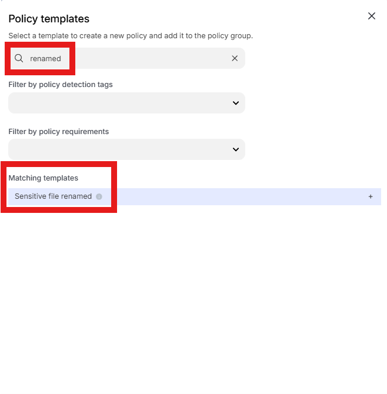
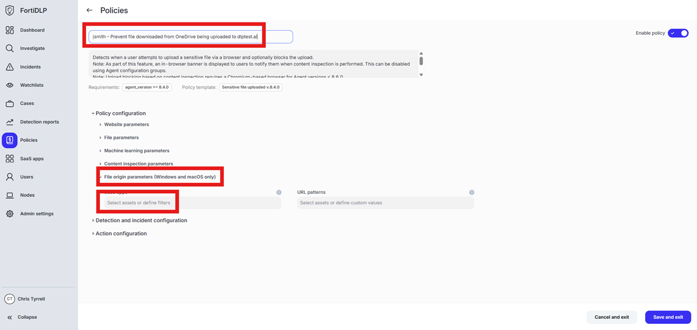
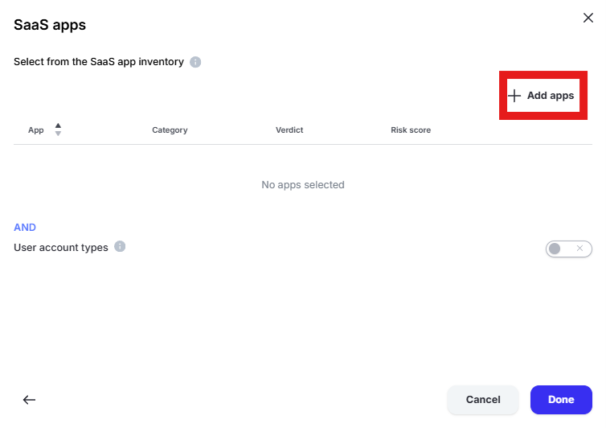
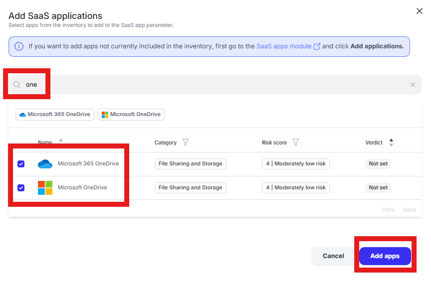
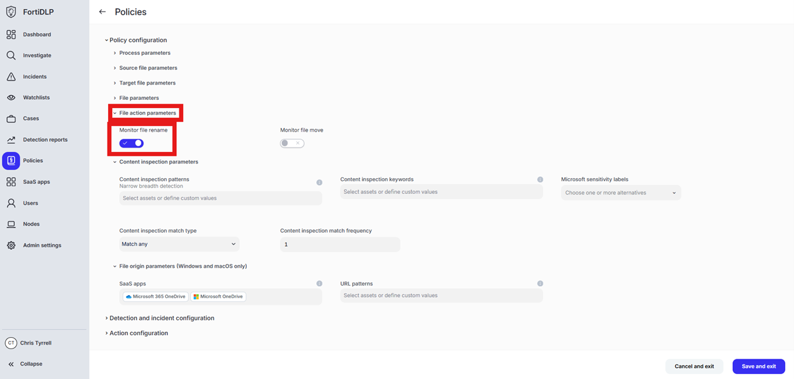
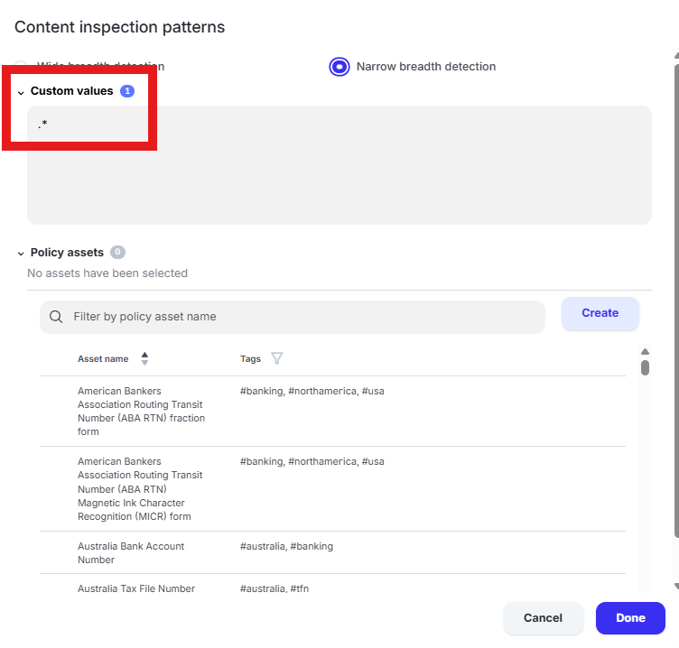
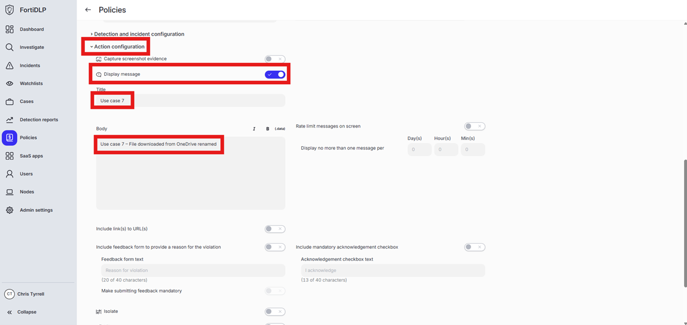

{} ### File downloaded from OneDrive Renamed
{}

1. Open the policy group created in use case 2 (if not already open)

2. Click “Add policies”

    

3. Enter “renamed” into the “Search” text box OR expand “File templates” and select “Sensitive file renamed”

    

4. Change the policy name to “jsmith – File downloaded from OneDrive renamed” where “jsmith” is your first initial and last name.

5. Scroll down to “File origin parameters (Windows and macOS only)” and click into “Select assets or define filters”

    

6. Click “Select from the SaaS app inventory”

    

7. Click “Add Apps” in the upper right hand corner of the window

    

8. Enter “one” into the “Filter by SaaS app name” text box and select “Microsoft 365 OneDrive” and “Microsoft OneDrive” by placing checks in the box. Click “Add apps”

    

9. Click “Done” to add the apps to the policy

10. Scroll to “File action parameters” and ensure “Monitor file rename” is selected

    

11. Scroll to “Content inspection parameters” and click “Select assets or define custom values”

12. Click the text box under “Custom Values” and enter “.*” in the box. Click “Done”

    

 {} For “Sensitive file” policies, you must configure a value in the content inspection section. “.*” will match any content.
{}

13. Scroll to and expand “Action configuration” and enable “Display message.” Enter “Use case 7” in the “Title” text box. Enter “Use case 7 – File downloaded from OneDrive renamed” in the “Body” text box. Optionally, enable the other options in the “Display message” area if desired.

    

14. Scroll down and click “Save and exit” in the lower right hand corner.

15. You should now see the newly created policy in the window
