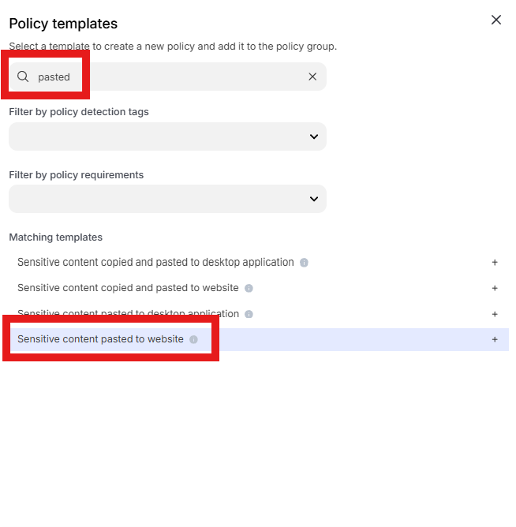
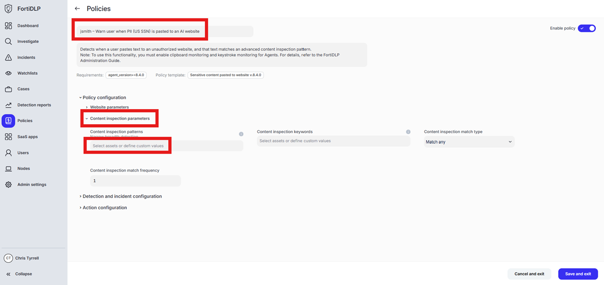
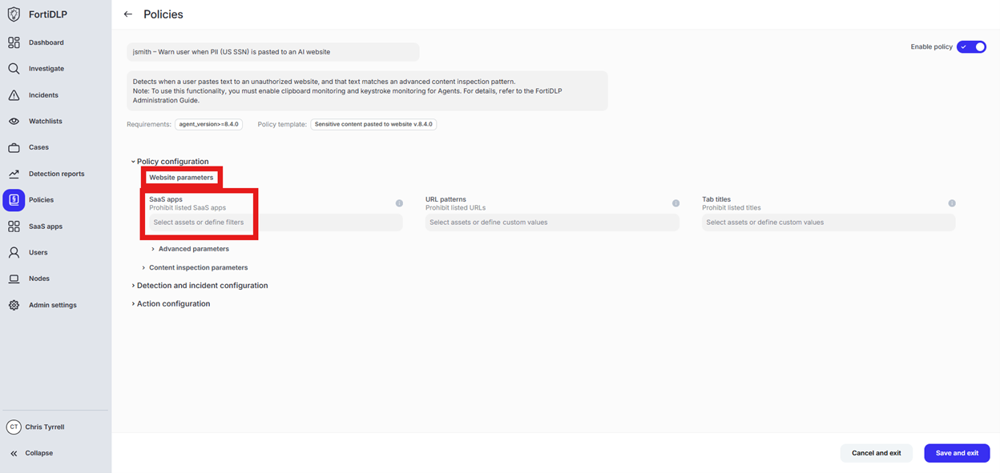
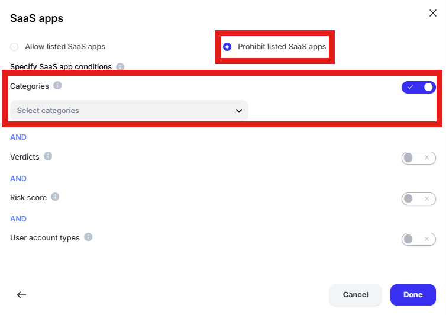
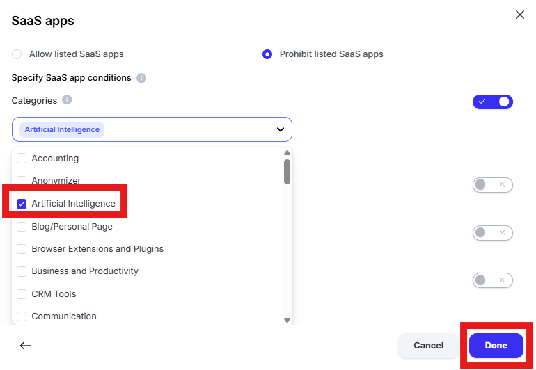
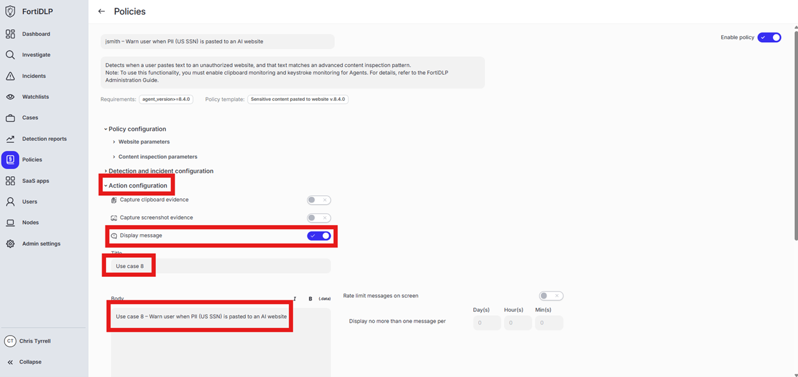

{} ### Warn User when PII (US SSN) is pasted to an AI website (chatgpt.com)
{}

1. Open the policy group created in use case 2 (if not already open)

2. Click “Add policies”

    

3. Enter “Pasted” into the “Search” text box OR expand “Clipboard Templates” and select “Sensitive content pasted to website”

    

4. Change the policy name to “jsmith – Warn user when PII (US SSN) is pasted to an AI website” where “jsmith” is your first initial and last name.

5. Scroll down to “Content inspection parameters” and click into “Select assets or define custom values” 

    

6. Enter “ssn” in the “Filter by policy asset name” and select “US Social Security Number (SSN)” by placing a check in the box. Click “Done” to finalize selection of the pattern.

    

{} “Wide breadth detection” will match on the number only. “Narrow breadth detection” will match on the specified pattern in addition to a keyword as defined in the “Policy asset” being used. The test file downloaded from dlptest.ai will trigger the alert with either wide or narrow breadth selected.
{}

7. Scroll to “Website parameters” and click into “Select assets or define filters” under “SaaS apps”

    

8. Click “Specify SaaS app conditions,” select “Prohibit listed SaaS apps” and enable “Categories”

    

9. Click “Select categories” and choose “Artificial Intelligence.” Click “Done”

    

10. Expand “Action configuration” and enable “Display message. Enter “Use case 8” in the “Title” text box. Enter “Use case 8 – Warn user when PII (US SSN) is pasted to an AI website” in the “Body” text box. Optionally, enable the other options in the “Display message” area if desired.

    

11. Scroll down and click “Save and exit” in the lower right hand corner.

12. You should now see the newly created policy in the window