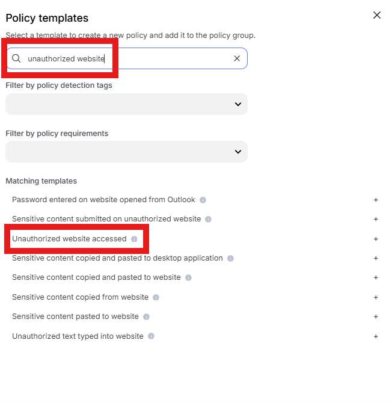
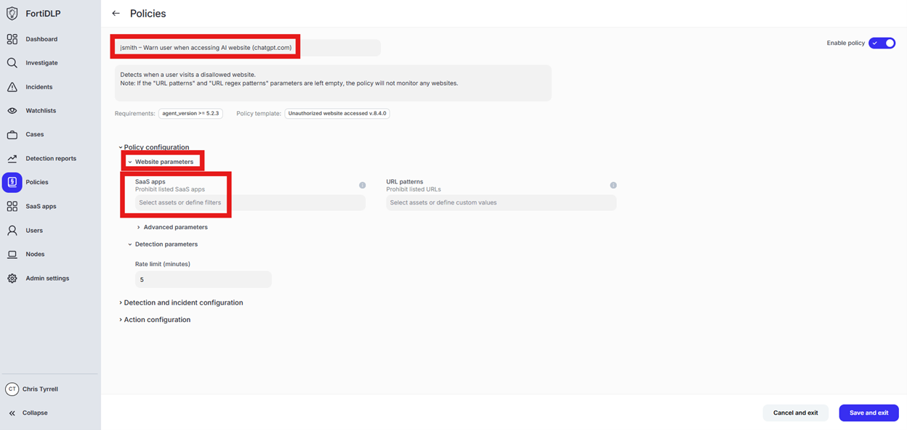
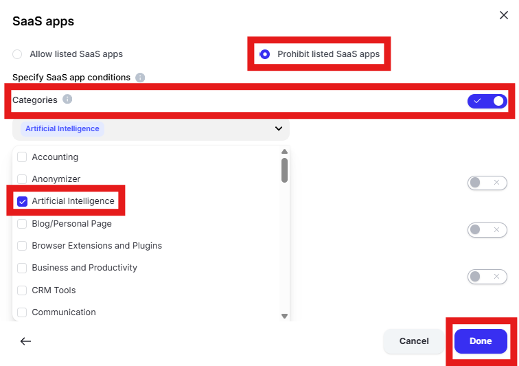
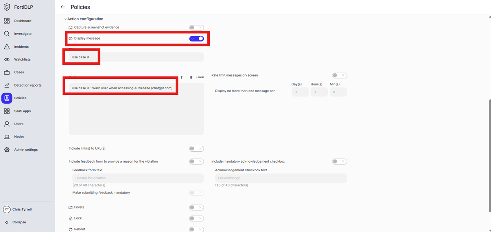

{} ### Generate a warning prompt for users visiting an AI website (chatgpt.com, etc.)
{}

1. Open the policy group created in use case 2 (if not already open)

2. Click “Add policies” 

    

3. Enter “Unauthorized website” into the “Search” text box OR expand “Browser templates” and select “Unauthorized website accessed”

   

4. Change the policy name to “jsmith – Warn user when accessing AI website (chatgpt.com)” where “jsmith” is your first initial and last name.

5. Scroll to “Website parameters” and click in “Select assets or define filters”

   

6. Click “Specify SaaS app conditions.” Select “Prohibit listed SaaS apps.” Turn on “Categories.” Click “Select categories” and choose “Artificial Intelligense.” Click “Done” to add the category to the policy.

   

7. Expand “Action configuration” and enable “Display message. Enter “Use case 9” in the “Title” text box. Enter “Use case 9 – Warn user when accessing AI website (chatgpt.com)” in the “Body” text box. Optionally, enable the other options in the “Display message” area if desired.

   

8. Scroll down and click “Save and exit” in the lower right hand corner.

9. You should now see the newly created policy in the window